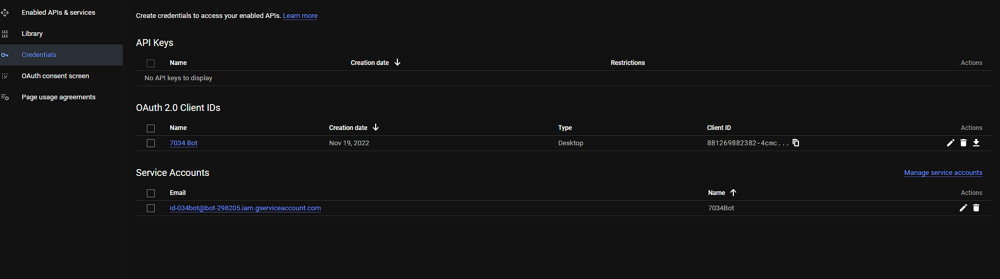
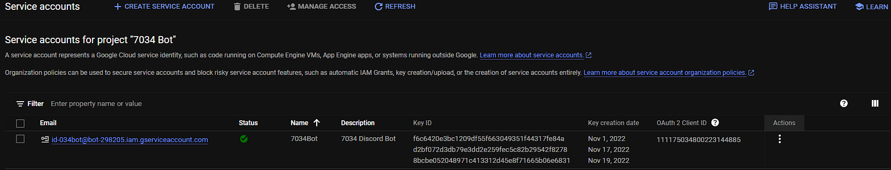
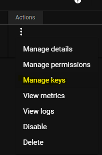
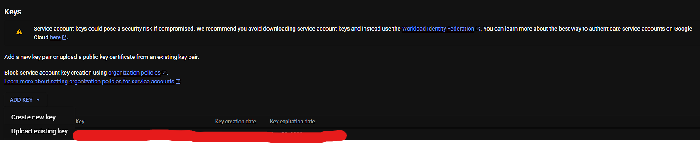
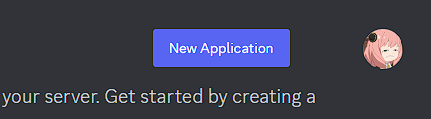
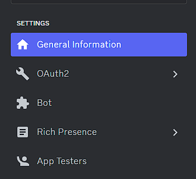
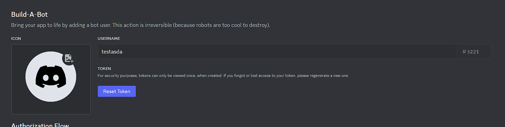
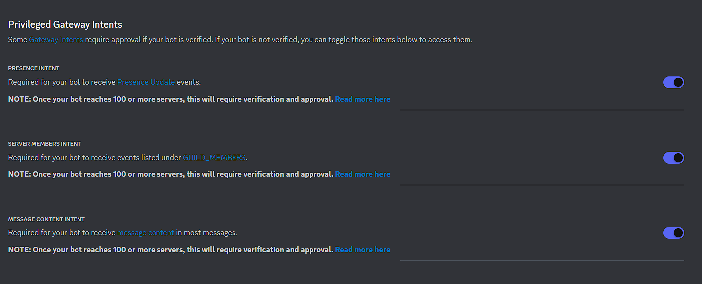
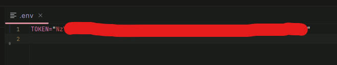
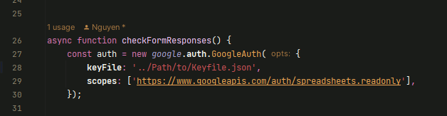

# What is this? 
This is a Discord.js bot that will connect with a Google spreadsheet (that's linked to a google form), and check if there's a new response to that form, and if it does, then it'll go to a channel, create a thread, and send a message in that thread saying **[this person] wants to trade [this shirt] for [this other shirt]**. 

And if anyone is interested, they can press an interaction button below the message in that thread, and the bot will dm them with the person's contact information. An example can be shown below. 

## How do you set it up and configurations
One of the things you want to do before you do anything below, is create a google form with the exact questions like https://forms.gle/mcsaEHdWnVna2QkA9 (If you want this to work out of the box), and then go to `responses` and link the form to a google sheet. 

You're free to create a new form with a new style, but it'll mess with how the messages are formatted, so you'll have to change the code to fit your form.  
1. go to [Google's Developer Console](https://console.cloud.google.com/), create a project, then go to APIs and Services in the Navigation Menu, look up Google Sheets API, and enable it. 
2. Then go to Credentials, and create a new Service account by going to "Manage Service Accounts"  And at the top, once you press that, you'll find a + with "Create Service Account", press that and go through the process of giving it a name, and a description. After that you can just press "Done", and bam, you created your first google service account. 

3. Now you should see your service account in your console on this page under "Service Accounts"  Under the "Actions" colum with the three dots and press "Manage Keys". 



4. After that you should be forwarded to a page with all your keys, in this case you don't have any keys since you just created the service account, but now Press "Add Key", and "Create new key". Pressing that will ask if you want a p12 or JSON file format, use JSON since it's the easier. So it should start downloading the json key file, which is good. 

5. Install the [NodeJS](https://nodejs.org/en) on your computer and follow the instructions. 

6. Now you want to clone this repository, there's two ways, doing it by the [Github Desktop Client](https://desktop.githib.com) or by cli, if you're doing cli install the git command line and input `git clone https://github.com/Ne-k/FRC-Shirt-Trading-Discord-Bot.git`, and same thing goes with the desktop client, but when you clone just use the url not the "git clone" part. 

7. Go to [Discord.com/developers](https://discord.com/developers) and create a new bot application by going to the top right corner and pressing "New Application"

 

Then give it a name, like "FRC Shirt Trading Bot" or something, and then press "Create". And you'll be brought to a new page, 
look for "Bot" under "Settings" on the left side of your screen 

 

press it and create a new bot if it already isn't, and Press the "Reset Token" button  doing so will show you the bot's token, save it because Discord won't tell you it again. Now scroll down a little but till you see "Privileged Gateway Intents"
 And make sure all the toggles are enabled. 

8. Great, you created a bot. Now with the saved bot token, go into the project files either by using Webstorm or Visual Studio Code, anything works if it can read code and create files. Go into the project's root directory and create a file named `.env` and add the following values to that file: 
```.dotenv
TOKEN="Discord Bot token"
DISCORD_CHANNEL_ID="Channel ID"
GOOGLE_SPREADSHEET_ID="Speadsheet ID"
```
It should look roughly like 

9. Now you have that `.env` file saved, remember that json file you downloaded from Google? Drag that into the project directory, then go into the `index.js` file and fill out the `formResponsesChannelId`, `spreadsheetID`, and about on line 28, where it has the ../path/to/Keyfile.json, replace that with the path to the json file you downloaded from Google, if it's in the root directory of the project, then the path would be something like `./<json_File_name>.json` 

10. Now in your console or terminal, type in the following: 
`npm install` and just give it a little but to install everything that's needed, and when you're ready, run `node .` or `node index.js` and it'll start right up and immediately start listening for new form responses. 

# Disclaimer 
> This is made for FRC Team 7034, and you're welcome to use it as you like, there may be issues within the code and unexpected errors so feel free to hit me up on Discord (Nek#0887) or create a new [issue](https://github.com/Ne-k/FRC-Shirt-Trading-Discord-Bot/issues)
>
> Contributions are welcome to not make this as jank as it already is. 


## TODO
- [ ] Implement slash commands - Code is already there for it
- [ ] Configurable database with slash commands

